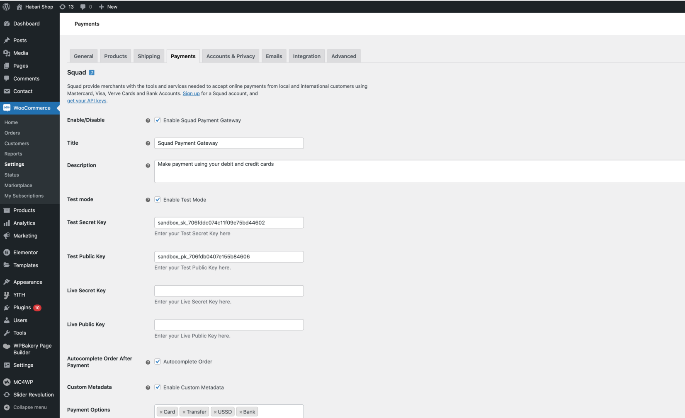
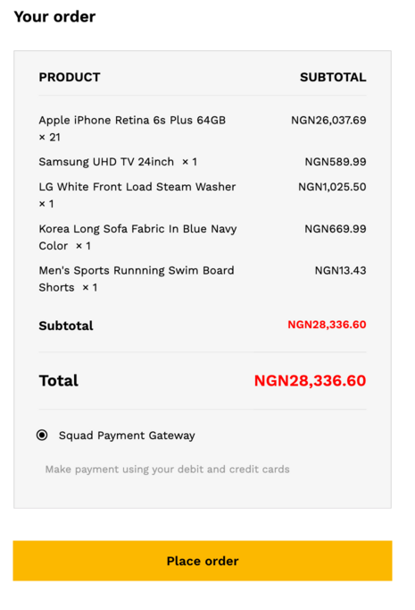
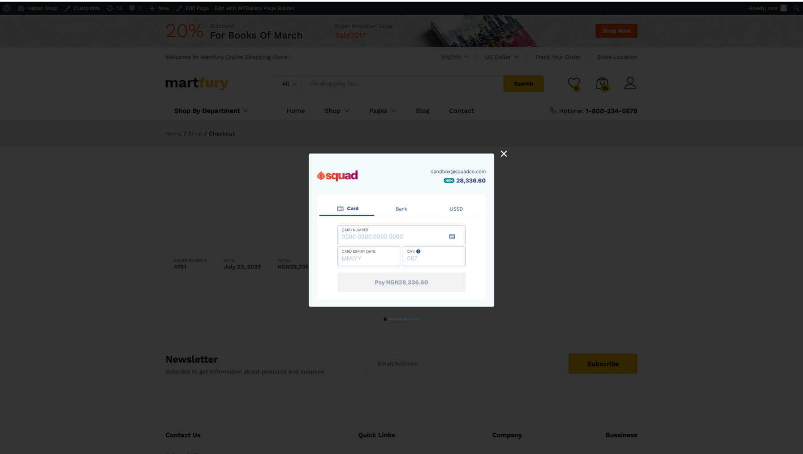

    

# WooCommerce Squad Payment Gateway

- **Contributors:** Squad Developers
- **Tags:** squad, woocommerce, payment, payment gateway, bank account, credit card, debit card, nigeria, international, mastercard, visa
- **Requires at least:** 4.4
- **Tested up to:** 6.0.1
- **Stable tag:** 1.0.12
- **License:** MIT - see below
- **License URI:** https://www.gnu.org/licenses/gpl-2.0.html

Take payments on your store using Squad.

## Description

Accept Credit card, Debit card and Bank account payment directly on your store with the Squad payment gateway for WooCommerce.

#### Take Credit card payments easily and directly on your store

Signup for an account [here](https://dashboard.squadco.com)

Squad is available in:

- **Nigeria**
<!-- - **Ghana**
- **Kenya**
- **Uganda**
- **Tanzania**
- **Rwanda**
- **South Africa** -->

<!-- ## Recurring Payment Support
For Recurring payment, you will need to install the [WooCommerce Subscriptions](https://woocommerce.com/products/woocommerce-subscriptions/) plugin. No subscription plans is created on Squad. The WooCommerce Subscriptions plugin handles all the subscription functionality. -->

## Installation

### Automatic Installation

- Login to your WordPress Dashboard.
- Click on "Plugins > Add New" from the left menu.
- In the search box type **WooCommerce Squad Payment Gateway**.
- Click on **Install Now** on **WooCommerce Squad Payment Gateway** to install the plugin on your site.
- Confirm the installation.
- Activate the plugin.
- Click on "WooCommerce > Settings" from the left menu and click the **"Payments"** tab.
- Click on the **Squad** link from the available Checkout Options
- Configure your **Squad Payment Gateway** settings accordingly.

### Manual Installation

- Download the plugin zip file.
- Login to your WordPress Admin. Click on "Plugins > Add New" from the left menu.
- Click on the "Upload" option, then click "Choose File" to select the zip file you downloaded. Click "OK" and "Install Now" to complete the installation.
- Activate the plugin.
- Click on "WooCommerce > Settings" from the left menu and click the **"Payments"** tab.
- Click on the **Squad** link from the available Checkout Options
- Configure your **Squad Payment Gateway** settings accordingly.

For FTP manual installation, [check here](http://codex.wordpress.org/Managing_Plugins#Manual_Plugin_Installation).

<!-- ## Split payment feature
* Enable the split payment in the squad woocommerce settings page.
* Enter the specify subaccounts for the split (create can create subaccounts on your Squad dashboard).
* save and start transaction -->

<!-- This split will be initiated for all transactions.

## Assign a subaccount to a Product
* Disable the split payment in the squad woocommerce settings page.
* Click on "Products".
* Select "Add New".
* Scroll down until you see the 'Squad - Select subaccount'.
* Select a subaccount. -->

### Configure the plugin

To configure the plugin, go to **WooCommerce > Settings** from the left menu, click **Payments** tab. Click on **Squad**.

- **Enable/Disable** - check the box to enable Squad Payment Gateway.
- **Mode** - check the box to enable Live Mode.
- **Webhook Instruction** - please ensure that you copied the url displayed in red into your Squad dashboard as described.
- **Enter Secret Hash** - ensure that secret hash entered is the same with the one on your Squad dashboard.
- **Squad Test Public Key** - enter your test public key sandbox.squadco.com.
- **Squad Test Secret Key** - enter your test secret key sandbox.squadco.com.
- **Squad Live Public Key** - enter your live public key dashboard.squadco.com.
- **Squad Live Secret Key** - enter your live secret key dashboard.squadco.com.
- Click **Save Changes** to save your changes.

## Screenshots

##### 1. Squad WooCommerce Payment Gateway Setting Page

###

##### 2. Squad WooCommerce Payment Gateway on woocommerce order checkout page

###

##### 3. Squad pay modal showing card payment option

###

### Suggestions / Contributions

To contribute, fork the repo, add your changes and modifications then create a pull request.

### License

##### MIT License

Permission is hereby granted, free of charge, to any person obtaining a copy
of this software and associated documentation files (the "Software"), to deal
in the Software without restriction, including without limitation the rights
to use, copy, modify, merge, publish, distribute, sublicense, and/or sell
copies of the Software, and to permit persons to whom the Software is
furnished to do so, subject to the following conditions:

The above copyright notice and this permission notice shall be included in all
copies or substantial portions of the Software.

THE SOFTWARE IS PROVIDED "AS IS", WITHOUT WARRANTY OF ANY KIND, EXPRESS OR
IMPLIED, INCLUDING BUT NOT LIMITED TO THE WARRANTIES OF MERCHANTABILITY,
FITNESS FOR A PARTICULAR PURPOSE AND NONINFRINGEMENT. IN NO EVENT SHALL THE
AUTHORS OR COPYRIGHT HOLDERS BE LIABLE FOR ANY CLAIM, DAMAGES OR OTHER
LIABILITY, WHETHER IN AN ACTION OF CONTRACT, TORT OR OTHERWISE, ARISING FROM,
OUT OF OR IN CONNECTION WITH THE SOFTWARE OR THE USE OR OTHER DEALINGS IN THE
SOFTWARE.
